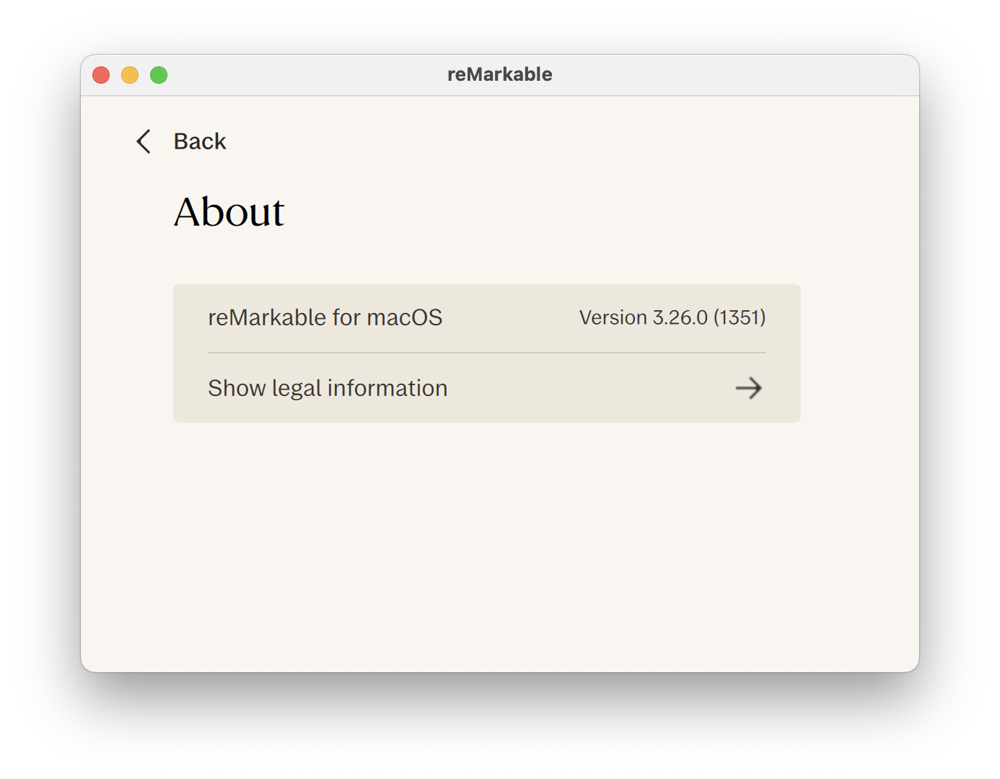
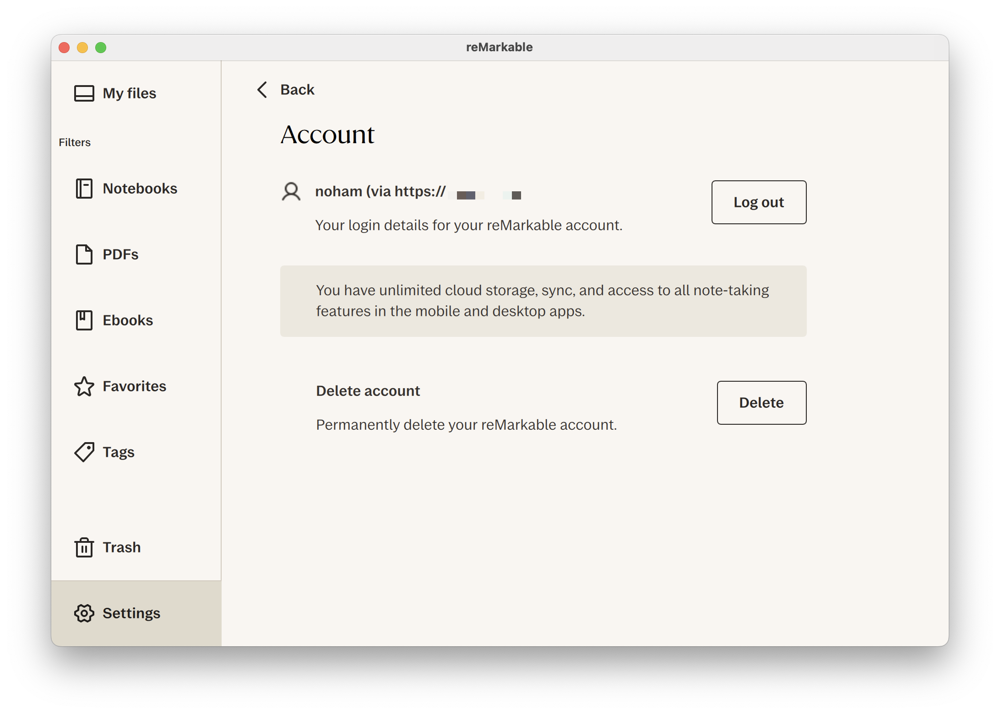
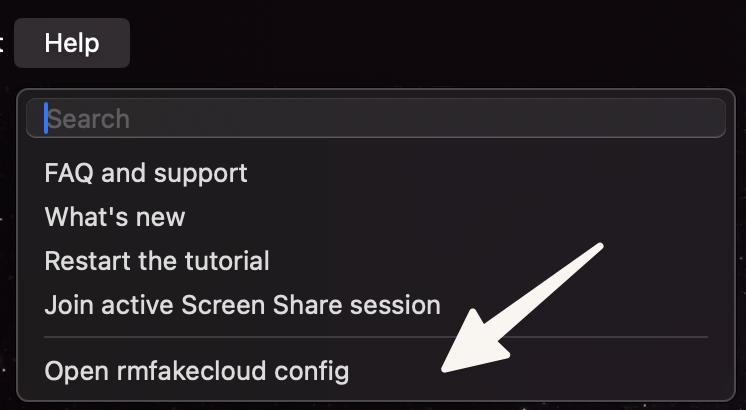

# RMHook

A dynamic library injection tool for the reMarkable Desktop macOS application, enabling connection to self-hosted [rmfakecloud](https://github.com/ddvk/rmfakecloud) servers.

## Overview

RMHook hooks into the reMarkable Desktop app's network layer to redirect API calls from reMarkable's official cloud services to your own [rmfakecloud](https://github.com/ddvk/rmfakecloud) server. This allows you to maintain full control over your documents and data.

## Features

- Network request interception and redirection
- WebSocket connection patching

## Compatibility

**Tested and working on:**
- reMarkable Desktop v3.23.0 (released 2025-11-05)

<p align="center">
  
  
</p>

## Installation and usage

### Important legal notice

⚠️ **For legal reasons, this repository does not include a pre-patched reMarkable app.** However, the latest compiled dylib is available in the [Releases](https://github.com/NohamR/RMHook/releases/latest) section.

### Step 1: Prepare the reMarkable app

Uses the reMarkable Desktop app from your Applications folder or download it fresh from the [Mac App Store](https://apps.apple.com/app/remarkable-desktop/id1276493162).

### Step 2: Inject the dylib

Use the provided injection script:
```bash
./scripts/inject.sh reMarkable.dylib reMarkable.app
```

This script will:
- Copy the dylib to the app bundle's Resources folder
- Copy the `libzstd.1.dylib` dependency and fix library references
- Inject the load command into the executable using `optool`
- Remove the code signature and resign with ad-hoc signature
- Remove the `_MASReceipt` folder
- Fix file ownership

### Step 3: Handle document storage

#### Important path changes

The original Mac App Store version stores data in sandboxed locations:
**Original sandboxed paths:**
- App data: `~/Library/Containers/com.remarkable.desktop/Data`
- Documents: `~/Library/Containers/com.remarkable.desktop/Data/Library/Application Support/remarkable`

**After re-signing, the app is no longer sandboxed** and will use standard paths:
- Config: `~/Library/Preferences/rmfakecloud.config`
- Documents: `~/Library/Application Support/remarkable`

#### Migration options

**Option 1: Create a symbolic link** (recommended)
```bash
ln -s ~/Library/Containers/com.remarkable.desktop/Data/Library/Application\ Support/remarkable \
      ~/Library/Application\ Support/remarkable
```
The symbolic link approach allows you to keep using the original App Store version alongside the patched version.

**Option 2: Move files**
```bash
mv ~/Library/Containers/com.remarkable.desktop/Data/Library/Application\ Support/remarkable \
   ~/Library/Application\ Support/remarkable
```

### Step 4: Configure rmfakecloud server
Quickly access the configuration file from the app's Help menu:


Edit the configuration file at:
```
~/Library/Preferences/rmfakecloud.config
```

Example configuration:
```json
{
  "host": "your-server.example.com",
  "port": 443
}
```

### Step 5: Launch the patched app :p

## How it works
RMHook uses [tinyhook](https://github.com/Antibioticss/tinyhook/) to hook into Qt framework functions at runtime:
1. **QNetworkAccessManager::createRequest** - Intercepts HTTP/HTTPS requests
2. **QWebSocket::open** - Patches WebSocket connections

When the app attempts to connect to reMarkable's servers (e.g., `internal.cloud.remarkable.com`), the hooks redirect these requests to your configured host and port.

## Configuration

The config file (`~/Library/Preferences/rmfakecloud.config`) supports the following keys:
| Key    | Type    | Default           | Description                    |
|--------|---------|-------------------|--------------------------------|
| `host` | String  | `example.com`     | Your rmfakecloud server host   |
| `port` | Number  | `443`             | Your rmfakecloud server port   |

If the config file doesn't exist, it will be created automatically with default values on first launch.

## Troubleshooting

### App won't launch
- Ensure the code signature was properly applied
- Check that `xattr -cr` was run to clear quarantine attributes
- Verify the dylib is in `Contents/Resources/` folder

### Document sync issues
- Ensure your rmfakecloud server is running and accessible
- Verify the storage path migration was completed

## Credits
- **xovi-rmfakecloud**: [asivery/xovi-rmfakecloud](https://github.com/asivery/xovi-rmfakecloud) - Original hooking information
- **tinyhook**: [Antibioticss/tinyhook](https://github.com/Antibioticss/tinyhook/) - Function hooking framework
- **rmfakecloud**: [ddvk/rmfakecloud](https://github.com/ddvk/rmfakecloud) - Self-hosted reMarkable cloud
- **optool**: [alexzielenski/optool](https://github.com/alexzielenski/optool) - Mach-O binary modification tool

## License

This project is licensed under the MIT License. See the [LICENSE](LICENSE) file for details.

## Disclaimer

This project is not affiliated with, endorsed by, or sponsored by reMarkable AS. Use at your own risk. This tool modifies the reMarkable Desktop application and may violate the application's terms of service.

## Contributing

Contributions are welcome! Please feel free to submit issues or pull requests.

## Building

1. **Clone the repository:**
```bash
git clone http://github.com/NohamR/RMHook
cd RMHook
```

2. **Compile the dylib:**
```bash
./scripts/build.sh [mode]
```

### Build modes

The build script supports different modes for various use cases:

| Mode | Description |
|------|-------------|
| `rmfakecloud` | Redirect reMarkable cloud to rmfakecloud server (default) |
| `qmldiff` | Qt resource data registration hooking (WIP) |
| `dev` | Development/reverse engineering mode with all hooks |
| `all` | Enable all modes |

Examples:
```bash
./scripts/build.sh              # Build with rmfakecloud mode (default)
./scripts/build.sh rmfakecloud  # Explicitly build rmfakecloud mode
./scripts/build.sh dev          # Build with dev/reverse engineering hooks
./scripts/build.sh all          # Build with all modes enabled
```